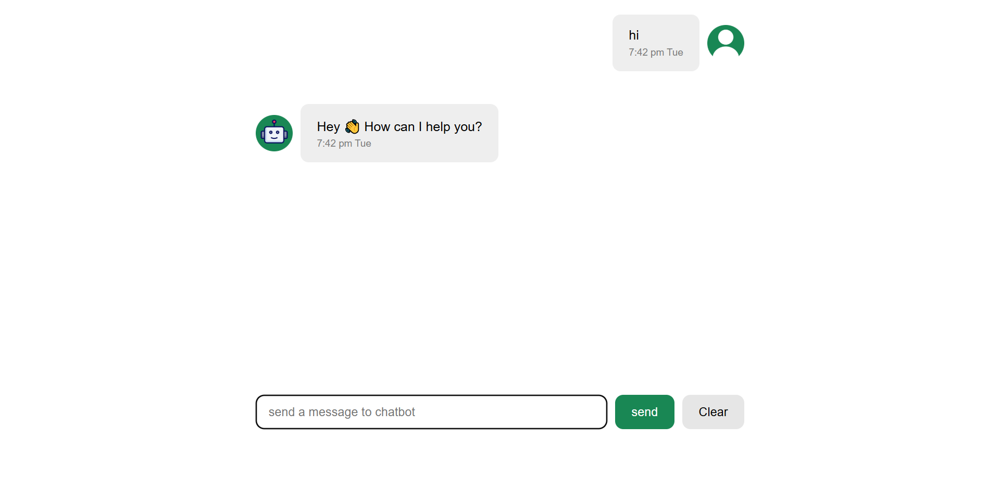

# Chatbot 

  A React chatbot that can answer simple questions and manage a personal watchlist for anime, drama, and movies.

## Features

  - Answer simple questions (date, time)
  - Save / delete / edit a watch list of anime, drama, and movies

  **Examples:**
    - `save/add anime Attack on Titan`
    - `delete/remove drama Goblin`
    - `edit movie Exit 8 to Forgotten`
    - `show anime list`
    - `show all`

  - LocalStorage persistence

## Tech

  - HTML
  - CSS
  - JavaScript (ES6 Modules)
  - React + Vite

## 📸 Screenshot
  

## Live Demo
  [View Live Website](https://watchlist-chatbot.netlify.app)

## Note
  This project was built following a tutorial, then later improved with additional features.